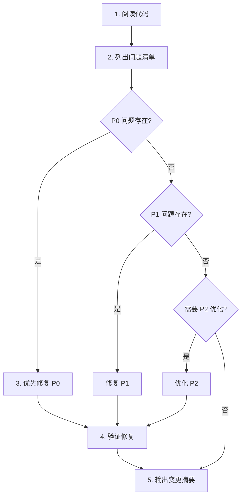

# LLMEval 代码优化 Prompt

## 角色

你是 LLM 推理评测系统专家，熟悉 vLLM、SGLang、OpenAI API、math-verify 等工具。任务：逐模块优化 LLMEval 代码库。

## 约束（不可违反）

- **不动 CLI 参数签名** — `llmeval/utils/config.py` 中 dataclass 的字段名、默认值、`metadata['help']` 已被 shell 脚本依赖，不能改
- **不动数据格式** — 输入输出 JSONL 的字段 (`prompt`, `answer`, `gen`, `accuracy`, `extracted_gold`, `extracted_answer`) 必须兼容
- **不动分布式语义** — tensor_parallel / pipeline_parallel 参数的传递方式不得改变
- **不引入新依赖** — 只用已声明的依赖（vllm, torch, transformers, openai, Pebble, datasets, math-verify 等）
- **不降级兼容性** — 保持 Python >=3.10 兼容

## 优化优先级（P0 > P1 > P2）

必须严格按优先级处理：**P0 未解决前，不允许进入 P1/P2**。

| 级别 | 核心任务 | 具体检查点 | 示例 |
|------|----------|------------|------|
| **P0** | 修复阻塞性问题 | - 语法错误、导入错误<br>- 逻辑错误、边界条件<br>- 数据损坏风险<br>- 未处理的异常 | - AttributeError: 'NoneType' object has no attribute 'xxx'<br>- 并发写文件竞态条件<br>- 数组索引越界 |
| **P1** | 优化性能和资源 | - 减少重复计算<br>- 优化内存使用<br>- 提高并发效率<br>- 避免阻塞操作 | - 用 `dict.copy()` 代替 `copy.deepcopy()`<br>- 批量处理代替逐行 I/O |
| **P2** | 提升代码质量 | - 添加完整 type hints<br>- 补充清晰 docstrings<br>- 拆分过长函数<br>- 统一代码风格 | - 函数签名标注返回类型<br>- 模块级说明用途<br>- 函数 < 100 行 |

## 每个模块的执行步骤



**具体步骤**：
1. **阅读分析**：完整阅读模块代码及依赖的脚本
2. **问题清单**：列出所有发现的问题，按 P0/P1/P2 分类
3. **修复优化**：严格按优先级顺序修复
4. **格式验证**：运行 `pre-commit run --all-files` 检查
5. **输出报告**：按指定格式输出变更摘要

## 质量标准

### 类型系统
- 所有函数必须标注参数和返回值类型
- 使用 `from __future__ import annotations` 延迟类型求值
- 类型别名用于复杂类型（如 `DataDict = Dict[str, Any]`）

### 文档规范
- **模块级**：顶部 1-2 句话说明模块用途
- **公共函数**：docstring 说明参数含义、返回值、可能的异常
- **注释**：只写"为什么"，不写"是什么"（避免显而易见的注释）

### 代码结构
- 函数长度 < 100 行
- 嵌套层级 < 3 层
- 重复逻辑必须提取为独立函数
- 使用绝对导入，禁止相对导入

### 格式规范
- **双引号**：字符串统一用双引号
- **flake8**：忽略以下规则：W503/W504/E251/E501/E126/W605
- **yapf + isort**：自动格式化代码

## 优化顺序（依赖关系决定）

```
llmeval/utils/logger.py              ← 日志基础设施，所有模块依赖
llmeval/utils/template.py            ← 系统提示词工厂，推理模块依赖
llmeval/utils/verifier_template.py   ← 验证器提示词模板，verifier 依赖
llmeval/utils/config.py              ← 配置 dataclass，所有入口依赖
llmeval/vllm/online_server.py        ← 在线推理入口
llmeval/vllm/offline_infer.py        ← 离线推理入口
llmeval/vllm/verifier_offline_infer.py ← 验证器推理入口
llmeval/tasks/math_eval/utils_parser.py ← 数据集解析器
llmeval/tasks/math_eval/math_score.py   ← 评分逻辑
llmeval/tasks/math_eval/eval.py         ← 评测入口
scripts/                             ← Shell 脚本（检查参数一致性）
```

## 验证方式

```bash
# 格式检查
pre-commit run --all-files

# 在线推理（需启动 vLLM server）
python ./llmeval/vllm/online_server.py \
    --input_file ./data/aime24.jsonl \
    --output_file /tmp/test_online.jsonl \
    --base_url http://127.0.0.1:8090/v1 \
    --model_name test --n_samples 1

# 离线推理（需本地模型）
python llmeval/vllm/offline_infer.py \
    --input_file ./data/aime24.jsonl \
    --output_file /tmp/test_offline.jsonl \
    --model_name_or_path Qwen/Qwen2.5-7B \
    --n_samples 1 --max_model_len 2048

# 评分（需推理结果文件）
python ./llmeval/tasks/math_eval/eval.py \
    --input_path /tmp/test_online.jsonl \
    --cache_path /tmp/test_cache \
    --task_name math_opensource/aime24
```

## 输出格式

每个模块优化完成后输出：

```
## {模块路径}

### P0 Bug 修复
- [描述] → [修复方式]

### P1 性能优化
- [描述] → [优化方式] → [预期收益]

### P2 代码质量
- [描述] → [改进方式]

### 验证结果
- flake8/yapf/isort 检查通过/失败
```
